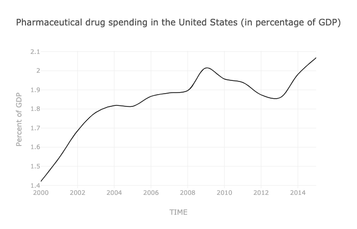

Anxiety disorder rates have been increasing among Americans of many age ranges for the past twenty years^[Hui Zheng, Paola Echave, Are Recent Cohorts Getting Worse? Trends in U.S. Adult Physiological Status, Mental Health, and Health Behaviors across a Century of Birth Cohorts, American Journal of Epidemiology, 2021;, kwab076, https://doi.org/10.1093/aje/kwab076], while an increased amount of money is continuing to be spent on the same treatments as in the past.^[Source: Health expenditure and financing: Health expenditure indicators]

{width=50}^[Source: Health expenditure and financing: Health expenditure indicators]


```{r setup, include=FALSE}
knitr::opts_chunk$set(echo = FALSE, fig.height = 10, fig.width=12)
library(tidyverse)
library(readr)
library(stringr)
library(tidyr)
```


```{r}
anxiety_raw <- read.csv('/Users/isaacfrank/Documents/R Projects/OCDProject/share-with-anxiety-disorders.csv')
anxiety_clean <- anxiety_raw %>%
  rename(Prevalence = Prevalence...Anxiety.disorders...Sex..Both...Age..Age.standardized..Percent.) %>%
  filter(Year == "2015" | Year == "2014" | Year == "2013" | Year == "2012" | Year == "2011" | Year == "2010") %>%
  select(-c(Entity)) %>%
  filter(Code == "AUT" | Code == "BEL" | Code == "CZE" | Code == "DNK" | Code == "FIN" | Code == "FRA" | Code == "DEU" | Code == "GRC" | Code == "HUN" | Code == "ISL" | Code == "IRL" | Code == "ITA" | Code == "KOR" | Code == "LUX" | Code == "MEX" | Code == "NLD" | Code == "NOR" | Code == "POL" | Code == "PRT" | Code == "SVK" | Code == "ESP" | Code == "SWE" | Code == "CHE" | Code == "USA" | Code == "EST" | Code == "SVN" | Code == "LVA" | Code == "LTU")
anxiety_clean <- anxiety_clean[!(is.na(anxiety_clean$Code) | anxiety_clean$Code==""), ] %>% 
  select(sort(tidyselect::peek_vars())) %>%
  arrange(Code)

view(anxiety_clean)
```

```{r}
drugs_raw <- read.csv("https://pkgstore.datahub.io/core/pharmaceutical-drug-spending/data_csv/data/db46fb3c420e7100e1d2b1f973e2cbcd/data_csv.csv")
drugs_clean <- drugs_raw %>%
  filter(TIME == "2015" | TIME == "2014" | TIME == "2013" | TIME == "2012" | TIME == "2011" | TIME == "2010") %>%
  filter(LOCATION == "AUT" | LOCATION == "BEL" | LOCATION == "CZE" | LOCATION == "DNK" | LOCATION == "FIN" | LOCATION == "FRA" | LOCATION == "DEU" | LOCATION == "GRC" | LOCATION == "HUN" | LOCATION == "ISL" | LOCATION == "IRL" | LOCATION == "ITA" | LOCATION == "KOR" | LOCATION == "LUX" | LOCATION == "MEX" | LOCATION == "NLD" | LOCATION == "NOR" | LOCATION == "POL" | LOCATION == "PRT" | LOCATION == "SVK" | LOCATION == "ESP" | LOCATION == "SWE" | LOCATION == "CHE" | LOCATION == "USA" | LOCATION == "EST" | LOCATION == "SVN" | LOCATION == "LVA" | LOCATION == "LTU") %>%
  select(c(LOCATION, PC_GDP, TIME)) %>% 
  select(sort(tidyselect::peek_vars())) %>%
  arrange(LOCATION)

view(drugs_clean)
```

```{r}
combined_data <- drugs_clean %>%
  mutate(pc_anxiety = anxiety_clean$Prevalence) 
  

combined_data %>%
  ggplot(aes(x = pc_anxiety, y = PC_GDP, label = LOCATION)) +
    geom_point() + geom_text(size = 4, check_overlap = TRUE, aes(label = LOCATION),hjust=1.2, vjust=-.2) + 
  geom_smooth(method = lm, formula = y~x, se = FALSE) + facet_wrap(~ TIME) +
  labs(title = "Anxiety Disorder Prevalence vs Percent GDP spent on Pharmaceuticals by Country from 2010-2015",
       subtitle = "Statistically Significant Negative Correlation, No Significant Changes Between Years",
       x = "Percentage of population with anxiety disorders",
       y = "Percent of GDP Spent on Pharmaceuticals",
       caption = "Source: Rosa et al. Our World In Data"
       ) + theme_test() + theme(text = element_text(size = 20))


cor.test(combined_data$pc_anxiety, combined_data$PC_GDP, method = "pearson", conf.level = 0.95)
view(combined_data)
```

At p = 0.05, this test is statistically significant, meaning that anxiety prevalence is negatively correlated 
with percent of GDP across the 28 countries with available data. While this association certainly does not
imply any causation, it is clear that increased spending on available pharmaceuticals does not correlate with
better solutions to anxiety. 


